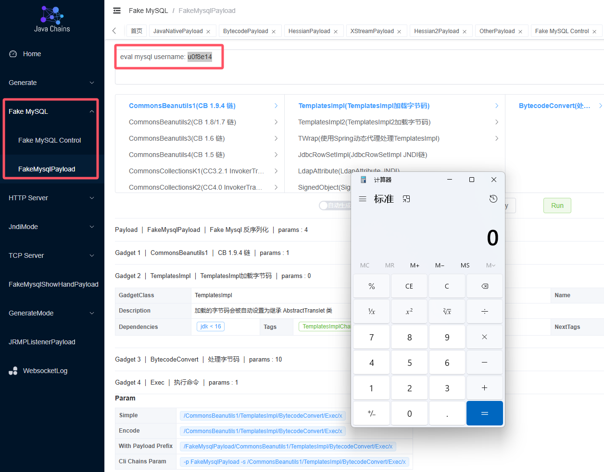
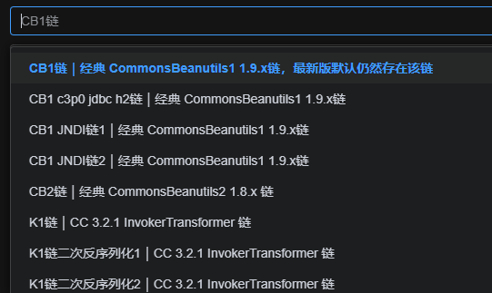

<h1 align="center">Web Chains</h1>
<div align="center">


</div>


`web-chains` 项目，又名 `java-chains` 项目，由 `Ar3h` 师傅主导开发，漏洞百出和代码审计星球支持


<div align="center">
    
</div>

我们站在巨人肩膀上，致力于打造最强的 `Java` 安全研究领域的瑞士军刀

## 介绍

`web-chains` 包含但不限于以下功能：

- `Java` 反序列化原生 `Payload` 生成
- `Hessian1/2` 反序列化 `Payload` 生成
- `Hessian1` 支持生成 `HessianServlet` 格式反序列化数据
- `Shiro` 数据生成（自定义 `KEY` 使用 `GCM` 混淆字符等）
- `AMF3` 数据生成（基于原生数据多种进阶组合）
- `XStream` 数据生成（基于原生数据多种进阶组合）
- `BCEL` 字节码生成（直接执行命令，内存马生成，回显生成，探测字节码，读写文件）
- `Class` 字节码生成（直接执行命令，内存马生成，回显生成，探测字节码，读写文件）
- 多种数据库 `Payload` 生成（`Derby` | `H2` | `PostgreSql` | `Sqlite`）
- `Fastjson/SnakeYAML/SpringBeanXML/Velocity/OGNL/MVEL/SPEL/JS/GROOVY`

一些混淆方式：

- 随机集合混淆
- 垃圾类插入
- 去除字节码符号信息
- `TC_RESET` 填充
- `UTF-8 Overlong Encoding` 混淆

一些高级选项：

- 自定义类名/定义字节码版本
- 选择 `Commons Beanutils` 链的多种 `comparator` 类型
- 支持生成 `TemplatesImpl` 格式
- 支持生成 `SnakeYaml Jar` 格式
- 支持生成 `Fastjson Groovy` 格式
- 支持生成 `JavaWrapper` 格式
- 支持生成 `charsets.jar` 格式
- 支持增强魔改版 `JMG/JEG` 格式 （java echo generator, java memshell generator)

Exploit 模块：

- JNDI (远程加载字节码，高版本反序列化绕过，高版本 `ref` 绕过，)
- Fake Mysql Server (经典 `JDBC` 攻击必备，基于生成模块多种进阶组合)
- JRMPListener / TCP Server（Derby RCE）/ HTTP Server

正在开发中：

- 一个完善的插件系统
- 更多的可用的 `gadget` 和 `payload` 生成
- 字节码混淆（方法名/隐藏方法/花指令/异或混淆等）
- 多种多样的可能的输出类型指定
- 覆盖更全面的测试和报告
- 多种 `gadget` 排序方式可选
- 用户自定义偏好 `gadget` 和 `payload` 展示
- 更多功能...

## 快速开始

你可以通过 `docker` 一条命令启动 `web-chains` 项目（这也是推荐做法）

```shell
docker run -d \
  --name web-chains \
  --restart=always \
  -p 8011:8011 \
  -p 58080:58080 \
  -p 50389:50389 \
  -p 13999:13999 \
  -p 3308:3308 \
  -p 11527:11527 \
  -p 50000:50000 \
  javachains/webchains:1.2.1
```

生成功能仅使用 `8011` 端口即可，其他端口为 `exploit` 模块使用

请使用以下命令获得随机的强用户名密码

```shell
docker logs $(docker ps | grep javachains/webchains | awk '{print $1}') | grep -E 'password'
```

输出示例

```text
11-12 06:59:53.301 INFO  [main] c.a.c.w.c.SecurityConfig       |  | generated random password: XSsWerJFGcCjB8FU
```

访问 `http://your-ip:8011` 即可（使用这里的用户名密码登录）

你也可以直接使用 `jar` 版本，使用 `java -jar web-chains.jar` 即可启动（推荐使用 `docker` 方式）

**特别注意：我们只对 8011 端口进行了保护，需要登陆后访问，其他端口可能存在被反制的风险，请自行注意**

## 详细使用

文档：https://www.yuque.com/shenjingwa-leuvd/wpqdhf/eekyvau9fcblzzt0

## 更新内容

`v1.2.1` 对部分链的描述信息做了优化

`v1.2.0` 版本大幅改进了配置信息的描述



`v1.2.0` 版本提供了内置的高质量常用组合链



## 参考和致谢

仅支持个人研究学习，切勿用于非法犯罪活动。

本项目的开发者、提供者和维护者不对使用者使用工具的行为和后果负责，工具的使用者应自行承担风险。

[更新日志 | CHANGELOG](CHANGELOG.md)

参考致谢：

- https://github.com/wh1t3p1g/ysomap
- https://github.com/qi4L/JYso
- https://github.com/X1r0z/JNDIMap
- https://github.com/Whoopsunix/PPPYSO
- https://github.com/4ra1n/mysql-fake-server
- https://github.com/mbechler/marshalsec
- https://github.com/frohoff/ysoserial
- https://github.com/H4cking2theGate/ysogate
- https://github.com/Bl0omZ/JNDIEXP
- https://github.com/kezibei/Urldns
- https://github.com/rebeyond/JNDInjector
- https://github.dev/LxxxSec/CTF-Java-Gadget
- https://github.com/pen4uin/java-memshell-generator
- https://github.com/pen4uin/java-echo-generator
- https://xz.aliyun.com/t/5381
- http://rui0.cn/archives/1408

## 交流

交流群请扫码，如果失效可加V备注项目名：`Y2VzaGkyMzQ1Njc=`

<div style="text-align: center;">

</div>

如果你觉得 `Java Chains / Web Chains` 项目对你有帮助，可以考虑支持一下我们

<div style="text-align: center;">

</div>

## Star History

[](https://star-history.com/#java-chains/web-chains&Date)
