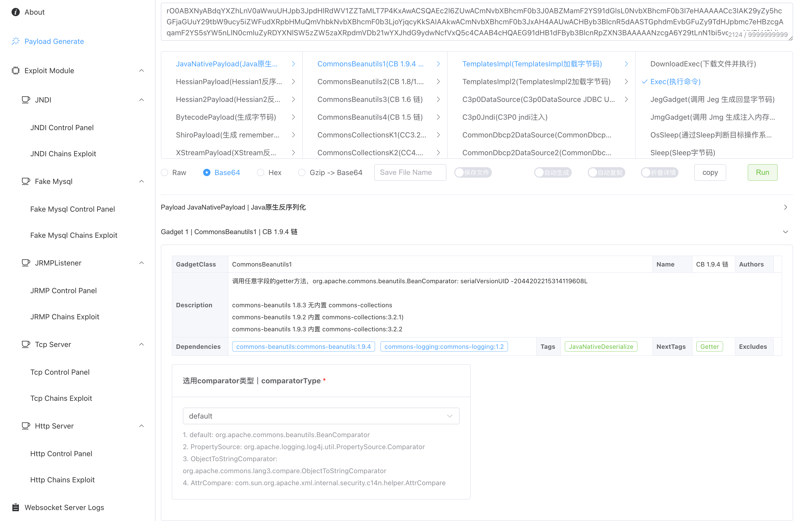

# Web-Chains

详细食用文档：https://www.yuque.com/shenjingwa-leuvd/wpqdhf/eekyvau9fcblzzt0?singleDoc#

## 简介

web-chains 包含但不限于以下功能：

- Java 反序列化Payload生成
  - 支持的混淆：随机集合混淆、垃圾类插入、TC_RESET 填充、utf8 overlong encoding 混淆
- Hessian 1/2 反序列化Payload生成

  - Hessian1 支持生成 HessianServlet 格式反序列化数据

  - 支持的混淆：随机集合混淆、垃圾类插入、utf8 overlong encoding 混淆
- 字节码生成

  - 支持自定义类名

  - 支持自定义字节码版本

  - 支持生成TemplatesImpl格式 Payload：实现 AbstractTranslet 接口

  - 支持生成SnakeYaml Jar 格式 Payload：实现 javax.script.ScriptEngineFactory 接口

  - 支持生成Fastjson Groovy 格式 Payload：实现 ASTTransformation 接口
  - 支持生成 JavaWrapper 格式 Payload：添加 `public static void _main(String[] argv) {}` 方法
  - 支持生成 charsets.jar 格式 Payload

  - 内置 java echo generator(Jeg)、java memshell generator(Jmg)，并根据实战进行魔改

  - ...
- Exploit 模块
  - JNDI Exploit
  - Fake Mysql
  - JRMPListener
  - Tcp Server（Derby RCE）
  - HTTP Server

## 更多

