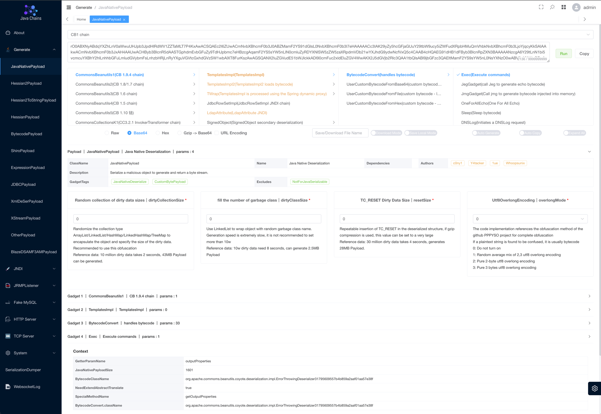

<h4 align="right">中文 | <strong><a href="./README_EN.md">English</a></strong> </h4>
<h1 align="center">Web Chains</h1>
<div align="center">


<div align="center">
    
</div>
</div>

`Web-Chains` 项目，又名 `Java-Chains` 项目，我们站在巨人肩膀上，致力于打造最强的 `Java` 安全研究领域的瑞士军刀

<p align="center">
  
</p>

## 介绍

`Web-Chains` 含有六大模块：

1. `Generate`: 生成模块
    - `Java` 反序列化原生 `Payload` 生成
    - `Hessian1/2` 反序列化 `Payload` 生成
    - `Hessian1` 支持生成 `HessianServlet` 格式反序列化数据
    - `Shiro` 数据生成（自定义 `KEY` 使用 `GCM` 混淆字符等）
    - `AMF3` 数据生成（基于原生数据多种进阶组合）
    - `XStream` 数据生成（基于原生数据多种进阶组合）
    - `BCEL` 字节码生成（直接执行命令，内存马生成，回显生成，探测字节码，读写文件）
    - `Class` 字节码生成（直接执行命令，内存马生成，回显生成，探测字节码，读写文件）
    - 多种数据库 JDBC Payload 生成（`Derby` | `H2` | `PostgreSql` | `Sqlite`）
    - `SnakeYAML/SpringBeanXML/Velocity/OGNL/MVEL/SPEL/JS/GROOVY`
    - Java反序列化、Hessian反序列化支持以下混淆方式：
        - 随机集合混淆
        - 垃圾类插入
        - 去除字节码符号信息
        - `TC_RESET` 填充，仅适用于Java反序列化
        - `UTF-8 Overlong Encoding` 混淆
    - 一些高级选项：
        - 自定义类名/定义字节码版本，支持使用 Class-Obf 进行字节码混淆
        - 选择 `Commons Beanutils` 链的多种 `comparator` 类型
        - 支持生成 `TemplatesImpl` 格式
        - 支持生成 `SnakeYaml Jar` 格式
        - 支持生成 `Fastjson Groovy` 格式
        - 支持生成 `JavaWrapper` 格式
        - 支持生成 `charsets.jar` 格式
        - 支持增强魔改版 `JMG/JEG` 格式 （java echo generator, java memshell generator)
2. `JNDI`: JNDI 注入利用模块
    - `JndiBasicPayload`: LDAP 远程加载字节码
    - `JndiDeserializationPayload`: LDAP 中基于 javaSerializedData 字段实现的反序列化
    - `JndiResourceRefPayload`: LDAP 基于 BeanFactory 的 Tomcat EL、Groovy等利用
    - `JndiReferencePayload`: LDAP 基于其他 ObjectFactory 的Reference利用，例如各种DataSource JDBC利用
    - `JndiRMIDeserializePayload`: LDAP 高版本 JDK 绕过之RMI反序列化
    - `JndiRefBypassPayload`: LDAP 高版本 JDK 绕过之ReferenceBypass
    - `JndiShowHandPayload`: JNDI梭哈链，一键测试常规利用链，提高测试效率
3. `Fake MySQL`
    - `FakeMysqlPayload`: 经典 MySQL JDBC 反序列化利用姿势
    - `FakeMysqlShowHandPayload`: FakeMySQL梭哈链，一键测试常规反序列化链，提高测试效率
4. `JRMPListener`
    - 可配合 JRMPClient 反序列化链实现RMI低版本的绕过
5. `TCP Server`
    - 一个简易的 TCP Server，可以将生成的Payload文件挂载到TCP端口服务上
    - 适用于 Derby 反序列化 RCE 场景，可直接通过tcp端口获取反序列化数据
6. `HTTP Server`
    - 一个简易的HTTP服务器，将生成的Payload文件挂载到HTTP端口服务上
    - 适用于 postgresql 远程加载 SpringBeanXML 文件等场景

## 快速开始

**特别注意：我们只对 8011 端口进行了保护，需要登陆后访问，其他端口可能存在被反制的风险，请自行注意**

### 方式一：Docker

你可以通过 `docker` 一条命令启动 `web-chains` 项目（这也是推荐做法）

```shell
docker run -d \
  --name web-chains \
  --restart=always \
  -p 8011:8011 \
  -p 58080:58080 \
  -p 50389:50389 \
  -p 50388:50388 \
  -p 13999:13999 \
  -p 3308:3308 \
  -p 11527:11527 \
  -p 50000:50000 \
  -e CHAINS_AUTH=true \
  -e CHAINS_PASS= \
  javachains/webchains:1.2.4
```

可通过环境变量配置鉴权或密码；
**CHAINS_AUTH**: true为开启鉴权，false为关闭鉴权，默认开启鉴权
**CHAINS_PASS**: 指定web密码，若该变量为空则随机生成密码，默认随机生成密码

备注：生成功能仅使用 `8011` 端口即可，其他端口为 `exploit` 模块使用

使用以下命令从docker中获取随机生成的强密码

```shell
docker logs $(docker ps | grep javachains/webchains | awk '{print $1}') | grep -E 'password'
```

输出示例

```text
11-12 06:59:53.301 INFO  [main] c.a.c.w.c.SecurityConfig       |  | password: XSsWerJFGcCjB8FU
```

访问 `http://your-ip:8011` 即可（使用这里的用户名密码登录）


### 方式二：Jar包启动

使用 `java -jar web-chains.jar` 即可启动，每次启动后会打印出随机生成的密码

默认监听 0.0.0.0 ，访问 `http://your-ip:8011` 即可（使用这里的用户名密码登录）

可通过环境变量设置web登录密码，例如：

Linux：
```bash
export CHAINS_PASS=[your_password] && java -jar web-chains.jar
```

Windows：
```cmd
set CHAINS_PASS=[your_password] && java -jar web-chains.jar
```

## 详细使用

详细使用文档：https://www.yuque.com/shenjingwa-leuvd/wpqdhf/eekyvau9fcblzzt0

## 更新内容

[CHANGELOG.md](./CHANGELOG.md)

## 参考和致谢

仅支持个人研究学习，切勿用于非法犯罪活动。

本项目的开发者、提供者和维护者不对使用者使用工具的行为和后果负责，工具的使用者应自行承担风险。

参考致谢：

- https://github.com/wh1t3p1g/ysomap
- https://github.com/qi4L/JYso
- https://github.com/X1r0z/JNDIMap
- https://github.com/Whoopsunix/PPPYSO
- https://github.com/jar-analyzer/class-obf
- https://github.com/4ra1n/mysql-fake-server
- https://github.com/jar-analyzer/class-obf
- https://github.com/mbechler/marshalsec
- https://github.com/frohoff/ysoserial
- https://github.com/H4cking2theGate/ysogate
- https://github.com/Bl0omZ/JNDIEXP
- https://github.com/kezibei/Urldns
- https://github.com/rebeyond/JNDInjector
- https://github.dev/LxxxSec/CTF-Java-Gadget
- https://github.com/pen4uin/java-memshell-generator
- https://github.com/pen4uin/java-echo-generator
- https://xz.aliyun.com/t/5381
- http://rui0.cn/archives/1408

## Star History

[](https://star-history.com/#java-chains/web-chains&Date)
