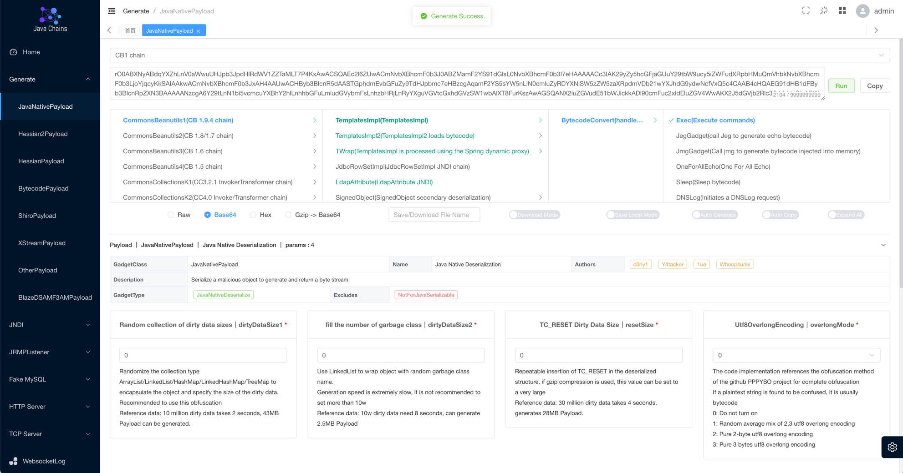

<h4 align="right"><strong><a href="./README.md">中文</a></strong> | English </h4>
<h1 align="center">Web Chains</h1>
<div align="center">


<div align="center">
    
</div>
</div>

The `Web-Chains` project, also known as the `Java-Chains` project, stands on the shoulders of giants and is committed to
building the Swiss Army knife of the strongest `Java` security research

<p align="center">
  
</p>

## 介绍

'Web-Chains' consists of six modules:

1. `Generate`: Generate modules
    - `Java` deserialization native 'Payload' generation
    - `Hessian1/2` deserializes 'Payload' generation
    - `Hessian1` supports generating deserialized data in `HessianServlet` format
    - `Shiro` data generation (custom 'KEY', use 'GCM' to obfuscate characters, etc.)
    - `AMF3` data generation (multiple advanced combinations based on native data)
    - `XStream` data generation (multiple advanced combinations based on native data)
    - `BCEL` bytecode generation (direct command execution, memory horse generation, echo generation, probe bytecode,
      read and write files)
    - `Class` bytecode generation (direct command execution, memory horse generation, echo generation, probe bytecode,
      read and write files)
    - Multiple databases JDBC Payload are generated（`Derby` | `H2` | `PostgreSql` | `Sqlite`）
    - `SnakeYAML/SpringBeanXML/Velocity/OGNL/MVEL/SPEL/JS/GROOVY`
    - Java deserialization and Hessian deserialization support the following obfuscation methods:
        - Random set obfuscation
        - Garbage class insertion
        - Removed bytecode symbol information
        - `TC_RESET` padding, which is only available for Java deserialization
        - `UTF-8 Overlong Encoding` obfuscation
   - Some advanced options:
      - Customize the class name/define the bytecode version
      - Select multiple `comparator` types for the `Commons Beanutils` chain
      - Support for generating `TemplatesImpl` format
      - Support for generating `SnakeYaml Jar` format
      - Support for generating `Fastjson Groovy` format
      - Support for generating `JavaWrapper` format
      - Support for generating `charsets.jar` format
      - Support enhanced magic modification `JMG/JEG` format （java echo generator, java memshell generator)
2. `JNDI`: JNDI Injection Utilization Module
    - `JndiBasicPayload`: LDAP remotely loads bytecode
    - `JndiDeserializationPayload`: Exploit posture for deserialization based on the javaSerializedData field in LDAP
    - `JndiResourceRefPayload`: LDAP is based on BeanFactory's Tomcat EL, Groovy, etc. utilization
    - `JndiReferencePayload`: LDAP is based on other ObjectFactory Reference exploits, such as various DataSource JDBC exploits
    - `JndiRMIDeserializePayload`: Later versions of the JDK bypass RMI deserialization
    - `JndiRefBypassPayload`: LDAP later version JDK bypasses
    - `JndiShowHandPayload`: JNDI show hand chain, one-click test routine utilization chain, improve testing efficiency
3. `Fake MySQL`
    - `FakeMysqlPayload`: Classic MySQL JDBC deserialization leverages poses
    - `FakeMysqlShowHandPayload`: FakeMySQL show hand chain, one-click test of conventional deserialization chain, improve testing efficiency
4. `JRMPListener`
    - It can be used with the JRMPClient deserialization chain
5. `TCP Server`
    - A simple TCP server that can mount the generated Payload file to the TCP port service
    - It is suitable for `derby` deserialization RCE scenarios, and can obtain deserialized data directly through the tcp port
6. `HTTP Server`
    - A simple HTTP server that mounts the generated Payload file to the HTTP port service
    - It is suitable for scenarios such as remote loading of SpringBeanXML files by postgresql

## Get Started Quickly

**Note: We only protect port 8011, you need to log in to access, other ports may be at risk of being countered, please pay attention to yourself**

### Method 1: Docker

You can start the web-chains project with a docker command (this is also recommended)

```shell
docker run -d \
  --name web-chains \
  --restart=always \
  -p 8011:8011 \
  -p 58080:58080 \
  -p 50389:50389 \
  -p 50388:50388 \
  -p 13999:13999 \
  -p 3308:3308 \
  -p 11527:11527 \
  -p 50000:50000 \
  javachains/webchains:1.2.2
```

The build function only uses the `8011` port, and the other ports are used by the `exploit` module

Please use the following command to get a randomly generated strong password

```shell
docker logs $(docker ps | grep javachains/webchains | awk '{print $1}') | grep -E 'password'
```

Sample output

```text
11-12 06:59:53.301 INFO  [main] c.a.c.w.c.SecurityConfig       |  | password: XSsWerJFGcCjB8FU
```

Just visit `http://your-ip:8011` (log in with your username and password here)

### Method 2: Start the JAR package

Use `java -jar web-chains-v1.2.2.jar` to get started

## Detailed use

Detailed Documentation: https://www.yuque.com/shenjingwa-leuvd/wpqdhf/war0zkzgzg3c4bzg

## Updated content

[CHANGELOG_EN.md](./CHANGELOG_EN.md)

## References and acknowledgments

It only supports personal research and learning, and should never be used for illegal and criminal activities.

The developers, providers and maintainers of the project are not responsible for the actions and consequences of the user's use of the tool, and the user of the tool shall do so at their own risk.

Acknowledgments:

- https://github.com/wh1t3p1g/ysomap
- https://github.com/qi4L/JYso
- https://github.com/X1r0z/JNDIMap
- https://github.com/Whoopsunix/PPPYSO
- https://github.com/4ra1n/mysql-fake-server
- https://github.com/mbechler/marshalsec
- https://github.com/frohoff/ysoserial
- https://github.com/H4cking2theGate/ysogate
- https://github.com/Bl0omZ/JNDIEXP
- https://github.com/kezibei/Urldns
- https://github.com/rebeyond/JNDInjector
- https://github.dev/LxxxSec/CTF-Java-Gadget
- https://github.com/pen4uin/java-memshell-generator
- https://github.com/pen4uin/java-echo-generator
- https://xz.aliyun.com/t/5381
- http://rui0.cn/archives/1408

## Communication

If you have any questions, please feel free to send issus

## Star History

[](https://star-history.com/#java-chains/web-chains&Date)
